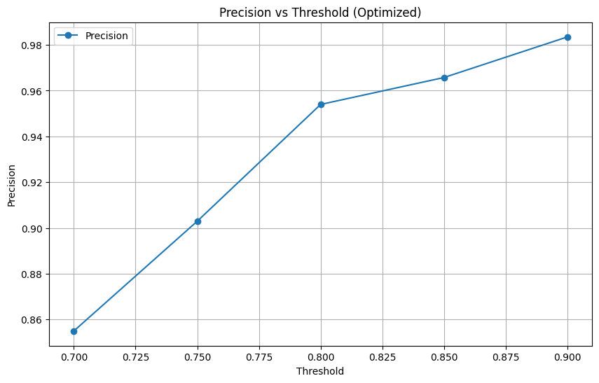

# Оптимизация модели XGBoost для задачи классификации

## Описание задачи
Цель проекта — построить и оптимизировать модель XGBoost для классификации с бинарным целевым признаком (0 или 1). Основное внимание уделялось достижению высокого значения **Precision** при различных трешхолдах вероятности.

## Методика

1. **Отбор признаков**  
   Для сокращения исходного набора из 168 признаков использовался метод **рекурсивного удаления признаков (RFE)** с перекрёстной проверкой (KFold). В результате отбора осталось 11 наиболее значимых признаков.

2. **Оптимизация гиперпараметров**  
   Для настройки гиперпараметров XGBoost использовалась библиотека **Optuna**. Оптимизация проводилась в течение 50 итераций, где целью было максимизировать **Precision** при трешхолде \(0.8\).

3. **Тестирование модели**  
   После оптимизации гиперпараметров модель была протестирована на различных трешхолдах (\(0.7\), \(0.75\), \(0.8\), \(0.85\), \(0.9\)) для анализа её поведения и определения оптимального уровня уверенности.

## Лучшие гиперпараметры
На основе байесовской оптимизации с помощью Optuna были выбраны следующие параметры модели:
- **learning_rate**: 0.0104
- **n_estimators**: 248
- **max_depth**: 8
- **min_child_weight**: 1
- **gamma**: 3.0065
- **colsample_bytree**: 0.7988

## Результаты модели
Модель была оценена на различных трешхолдах. Основные метрики представлены в таблице:

| Threshold | Precision | True Positives | False Positives | False Positive Rate |
|-----------|-----------|----------------|------------------|---------------------|
| 0.70      | 0.854982  | 4127           | 700              | 0.005018            |
| 0.75      | 0.902938  | 2428           | 261              | 0.001871            |
| 0.80      | 0.953966  | 1347           | 65               | 0.000466            |
| 0.85      | 0.965732  | 620            | 22               | 0.000158            |
| 0.90      | 0.983471  | 119            | 2                | 0.000014            |

## Выводы

1. Оптимальный трешхолд **0.8** обеспечивает:
   - Precision = **0.9539**.
   - Минимальное количество ложных срабатываний (False Positives = 65).
   - Достаточно высокий True Positive Rate (1347).

2. С увеличением трешхолда точность (Precision) возрастает, но количество True Positives резко снижается.

## Дополнительно

1. **Оптимизация на трешхолде 0.8**  
   На этапе оптимизации гиперпараметры модели были настроены для максимизации Precision именно при трешхолде \(0.8\).

2. **Тестирование на других трешхолдах**  
   После оптимизации модель была протестирована на трешхолдах \(0.7\), \(0.75\), \(0.85\), \(0.9\). Это позволило оценить влияние изменения уровня уверенности на точность и полноту.

## Визуализация
График зависимости Precision от Threshold:

## Использованные технологии
- Python
- Библиотеки: **XGBoost**, **Optuna**, **scikit-learn**, **matplotlib**, **pandas**
- Байесовская оптимизация гиперпараметров с использованием **Optuna**.
